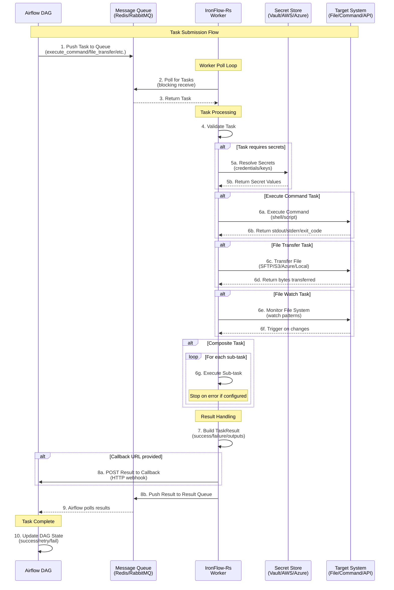
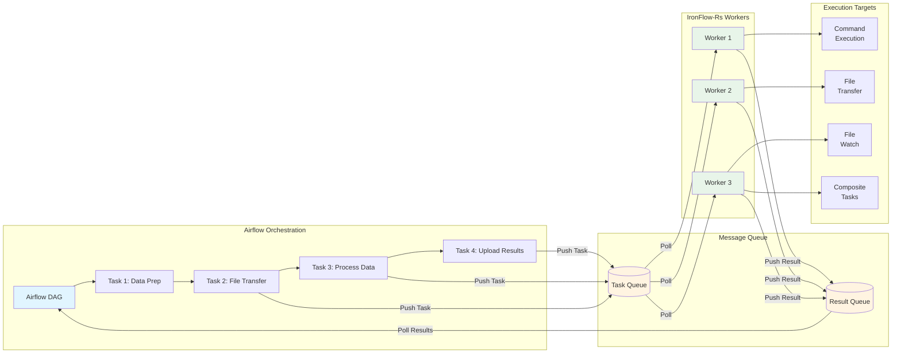

# IronFlow-Rs

A high-performance, enterprise-grade Rust-based worker agent designed as a Control-M replacement. IronFlow-Rs works as a Celery-like worker that processes tasks from message queues (Redis, RabbitMQ) with support for command execution, file watching, file transfers, and secret management.

## Features

### Core Capabilities

- **🔄 Multiple Queue Support**: Redis and RabbitMQ with pluggable architecture for adding more
- **📁 File Watcher**: Monitor file system changes with pattern matching and trigger tasks
- **⚡ Command Execution**: Execute commands with single-shot or polling modes
- **📦 File Transfer**: Enterprise-grade file transfers supporting:
  - Local filesystem
  - FTP/FTPS
  - SFTP
  - S3 (AWS, MinIO, etc.)
  - Azure Blob Storage
  - Multi-cloud support via OpenDAL
- **🔐 Secret Management**: Integrated support for:
  - HashiCorp Vault
  - AWS Secrets Manager
  - Azure Key Vault
- **📊 Structured Logging**: Based on [standard-app-log](https://github.com/preedep/standard-app-log) specification
- **🏗️ Clean Architecture**: Domain-driven design with clear separation of concerns
- **✅ Cross-Platform**: Supports Windows, Linux, and macOS

### Task Types

1. **ExecuteCommand**: Run a command and return immediately
2. **ExecutePolling**: Run a command and poll until completion
3. **FileWatch**: Monitor file system changes and trigger actions
4. **FileTransfer**: Transfer files between various storage systems
5. **Composite**: Execute multiple tasks in sequence with error handling

## Architecture

### End-to-End Flow

IronFlow-Rs works as a Celery-compatible worker that integrates with Airflow DAGs and other task orchestrators:



### System Architecture

IronFlow-Rs follows Clean Architecture principles with three main layers:

```
┌─────────────────────────────────────────────────────────────┐
│                      Application Layer                       │
│  ┌──────────────┐              ┌─────────────────┐          │
│  │   Worker     │──────────────│ TaskProcessor   │          │
│  └──────────────┘              └─────────────────┘          │
└─────────────────────────────────────────────────────────────┘
                            │
┌─────────────────────────────────────────────────────────────┐
│                       Domain Layer                           │
│  ┌──────────────┐  ┌──────────────┐  ┌──────────────┐      │
│  │  Entities    │  │ Repositories │  │   Services   │      │
│  │  - Task      │  │ - Queue      │  │ - Command    │      │
│  │  - Result    │  │ - Secret     │  │ - Transfer   │      │
│  │  - FileEvent │  │              │  │ - Watcher    │      │
│  └──────────────┘  └──────────────┘  └──────────────┘      │
└─────────────────────────────────────────────────────────────┘
                            │
┌─────────────────────────────────────────────────────────────┐
│                   Infrastructure Layer                       │
│  ┌──────────────┐  ┌──────────────┐  ┌──────────────┐      │
│  │   Queues     │  │   Secrets    │  │   Services   │      │
│  │  - Redis     │  │  - Vault     │  │  - Executor  │      │
│  │  - RabbitMQ  │  │  - AWS       │  │  - Transfer  │      │
│  │              │  │  - Azure     │  │  - Watcher   │      │
│  └──────────────┘  └──────────────┘  └──────────────┘      │
└─────────────────────────────────────────────────────────────┘
```

### Integration with Airflow



## Installation

### Prerequisites

- Rust 1.70 or higher
- Redis or RabbitMQ (depending on your queue choice)
- Optional: Vault, AWS credentials, or Azure credentials for secret management

### Build from Source

```bash
git clone https://github.com/yourusername/ironflow-rs.git
cd ironflow-rs
cargo build --release
```

The binary will be available at `target/release/ironflow-rs`

## Configuration

IronFlow-Rs can be configured via environment variables with the `IRONFLOW_` prefix or a configuration file.

### Environment Variables

```bash
# Worker Configuration
IRONFLOW_WORKER_ID=worker-001
IRONFLOW_WORKER__CONCURRENCY=4

# Queue Configuration (Redis)
IRONFLOW_QUEUE__TYPE=redis
IRONFLOW_QUEUE__URL=redis://localhost:6379
IRONFLOW_QUEUE__TASK_QUEUE=ironflow:tasks
IRONFLOW_QUEUE__RESULT_QUEUE=ironflow:results

# Queue Configuration (RabbitMQ)
IRONFLOW_QUEUE__TYPE=rabbitmq
IRONFLOW_QUEUE__URL=amqp://localhost:5672
IRONFLOW_QUEUE__TASK_QUEUE=ironflow.tasks
IRONFLOW_QUEUE__RESULT_QUEUE=ironflow.results
IRONFLOW_QUEUE__PREFETCH_COUNT=10

# Secret Management (Vault)
IRONFLOW_SECRETS__TYPE=hashicorp_vault
IRONFLOW_SECRETS__URL=http://localhost:8200
IRONFLOW_SECRETS__TOKEN=your-vault-token
IRONFLOW_SECRETS__MOUNT_PATH=secret

# Logging
IRONFLOW_LOGGING__LEVEL=info
IRONFLOW_LOGGING__FORMAT=json
IRONFLOW_LOGGING__SERVICE_ID=ironflow-worker
```

### Configuration File Example

Create a `config.toml` file:

```toml
worker_id = "worker-001"

[app]
id = "ironflow-rs"
version = "0.1.0"
geo_location = "us-east-1"

[queue]
type = "redis"
url = "redis://localhost:6379"
task_queue = "ironflow:tasks"
result_queue = "ironflow:results"

[secrets]
type = "hashicorp_vault"
url = "http://localhost:8200"
token = "your-vault-token"
mount_path = "secret"

[logging]
level = "info"
format = "json"
service_id = "ironflow-worker"
service_version = "0.1.0"

[worker]
concurrency = 4
receive_timeout_secs = 30
max_task_timeout_secs = 3600
shutdown_timeout_secs = 30
health_check_interval_secs = 60
```

## Usage

### Starting the Worker

```bash
# Using environment variables
export IRONFLOW_QUEUE__URL=redis://localhost:6379
./target/release/ironflow-rs

# Or with a config file
IRONFLOW_CONFIG_FILE=config.toml ./target/release/ironflow-rs
```

### Task Examples

#### Execute Command Task

```json
{
  "id": "550e8400-e29b-41d4-a716-446655440000",
  "task_type": {
    "type": "execute_command",
    "command": "python",
    "args": ["script.py", "--input", "data.csv"],
    "working_dir": "/opt/scripts",
    "env_vars": {
      "PYTHONPATH": "/opt/lib"
    }
  },
  "priority": 0,
  "max_retries": 3,
  "callback_url": "https://api.example.com/task-callback",
  "correlation_id": "batch-job-123"
}
```

#### File Transfer Task

```json
{
  "id": "550e8400-e29b-41d4-a716-446655440001",
  "task_type": {
    "type": "file_transfer",
    "source": {
      "type": "sftp",
      "host": "sftp.example.com",
      "port": 22,
      "path": "/data/input.csv",
      "username": "user",
      "key_secret": "vault:ssh/private_key"
    },
    "destination": {
      "type": "s3",
      "bucket": "my-bucket",
      "key": "data/input.csv",
      "region": "us-east-1"
    },
    "options": {
      "overwrite": true,
      "create_dirs": true,
      "preserve_metadata": true
    }
  }
}
```

#### File Watch Task

```json
{
  "id": "550e8400-e29b-41d4-a716-446655440002",
  "task_type": {
    "type": "file_watch",
    "path": "/data/incoming",
    "patterns": ["*.csv", "*.json"],
    "recursive": true,
    "on_change_tasks": [
      {
        "type": "execute_command",
        "command": "process-file",
        "args": ["${file_path}"]
      }
    ]
  }
}
```

#### Composite Task

```json
{
  "id": "550e8400-e29b-41d4-a716-446655440003",
  "task_type": {
    "type": "composite",
    "tasks": [
      {
        "type": "file_transfer",
        "source": {"type": "sftp", "...": "..."},
        "destination": {"type": "local", "path": "/tmp/data.csv"}
      },
      {
        "type": "execute_command",
        "command": "process-data",
        "args": ["/tmp/data.csv"]
      },
      {
        "type": "file_transfer",
        "source": {"type": "local", "path": "/tmp/result.csv"},
        "destination": {"type": "s3", "...": "..."}
      }
    ],
    "stop_on_error": true
  }
}
```

## Sending Tasks to the Queue

### Using Redis

```python
import redis
import json

r = redis.Redis(host='localhost', port=6379)

task = {
    "id": "550e8400-e29b-41d4-a716-446655440000",
    "task_type": {
        "type": "execute_command",
        "command": "echo",
        "args": ["Hello, IronFlow!"]
    },
    "priority": 0,
    "max_retries": 3
}

r.lpush('ironflow:tasks', json.dumps(task))
```

### Using RabbitMQ

```python
import pika
import json

connection = pika.BlockingConnection(pika.ConnectionParameters('localhost'))
channel = connection.channel()

channel.queue_declare(queue='ironflow.tasks', durable=True)

task = {
    "id": "550e8400-e29b-41d4-a716-446655440000",
    "task_type": {
        "type": "execute_command",
        "command": "echo",
        "args": ["Hello, IronFlow!"]
    }
}

channel.basic_publish(
    exchange='',
    routing_key='ironflow.tasks',
    body=json.dumps(task),
    properties=pika.BasicProperties(delivery_mode=2)
)

connection.close()
```

## Logging

IronFlow-Rs uses structured logging based on the [standard-app-log](https://github.com/preedep/standard-app-log) specification. All logs are output in JSON format:

```json
{
  "event_date_time": "2024-12-24T06:20:00.000Z",
  "log_type": "APP_LOG",
  "app_id": "ironflow-rs",
  "app_version": "0.1.0",
  "service_id": "ironflow-worker",
  "service_version": "0.1.0",
  "correlation_id": "batch-job-123",
  "level": "info",
  "execution_time": 1250,
  "message": "Task completed successfully"
}
```

## Development

### Running Tests

```bash
# Run all tests
cargo test

# Run tests with output
cargo test -- --nocapture

# Run specific test
cargo test test_execute_command

# Run integration tests (requires Redis/RabbitMQ)
cargo test --test integration -- --ignored
```

### Project Structure

```
ironflow-rs/
├── src/
│   ├── domain/              # Domain layer (business logic)
│   │   ├── entities/        # Domain entities
│   │   ├── repositories/    # Repository traits
│   │   ├── services/        # Service traits
│   │   └── value_objects/   # Value objects and configs
│   ├── infrastructure/      # Infrastructure layer (implementations)
│   │   ├── logging/         # Structured logging
│   │   ├── queues/          # Queue implementations
│   │   ├── secrets/         # Secret management
│   │   └── services/        # Service implementations
│   ├── application/         # Application layer (orchestration)
│   │   ├── task_processor.rs
│   │   └── worker.rs
│   ├── lib.rs
│   └── main.rs
├── Cargo.toml
└── README.md
```

## Deployment

### Docker

Create a `Dockerfile`:

```dockerfile
FROM rust:1.70 as builder
WORKDIR /app
COPY . .
RUN cargo build --release

FROM debian:bookworm-slim
RUN apt-get update && apt-get install -y ca-certificates && rm -rf /var/lib/apt/lists/*
COPY --from=builder /app/target/release/ironflow-rs /usr/local/bin/
CMD ["ironflow-rs"]
```

Build and run:

```bash
docker build -t ironflow-rs .
docker run -e IRONFLOW_QUEUE__URL=redis://redis:6379 ironflow-rs
```

### Kubernetes

```yaml
apiVersion: apps/v1
kind: Deployment
metadata:
  name: ironflow-worker
spec:
  replicas: 3
  selector:
    matchLabels:
      app: ironflow-worker
  template:
    metadata:
      labels:
        app: ironflow-worker
    spec:
      containers:
      - name: worker
        image: ironflow-rs:latest
        env:
        - name: IRONFLOW_QUEUE__URL
          value: "redis://redis-service:6379"
        - name: IRONFLOW_WORKER__CONCURRENCY
          value: "4"
        resources:
          requests:
            memory: "256Mi"
            cpu: "250m"
          limits:
            memory: "512Mi"
            cpu: "500m"
```

## Performance

IronFlow-Rs is designed for high performance and low resource usage:

- **Concurrency**: Process multiple tasks simultaneously with configurable worker pools
- **Memory Efficient**: Rust's zero-cost abstractions and ownership model
- **Fast Startup**: Typically starts in under 1 second
- **Low Overhead**: Minimal CPU usage when idle

## Security

- **Secret Management**: Never store secrets in code or configuration files
- **TLS Support**: All network communications can use TLS/SSL
- **Least Privilege**: Run with minimal required permissions
- **Audit Logging**: All operations are logged with correlation IDs

## Contributing

Contributions are welcome! Please follow these guidelines:

1. Fork the repository
2. Create a feature branch
3. Write tests for new functionality
4. Ensure all tests pass
5. Submit a pull request

## License

This project is licensed under the MIT License - see the LICENSE file for details.

## Roadmap

- [ ] Web UI for monitoring and management
- [ ] Metrics and monitoring (Prometheus/Grafana)
- [ ] Additional queue backends (Kafka, NATS)
- [ ] Plugin system for custom task types
- [ ] Distributed tracing support (OpenTelemetry)
- [ ] Task scheduling and cron support
- [ ] Task dependency management

## Support

For issues, questions, or contributions, please open an issue on GitHub.

## Acknowledgments

- Built with [Rust](https://www.rust-lang.org/)
- Uses [OpenDAL](https://opendal.apache.org) for multi-cloud storage
- Logging based on [standard-app-log](https://github.com/preedep/standard-app-log)
- Inspired by Celery and Control-M
